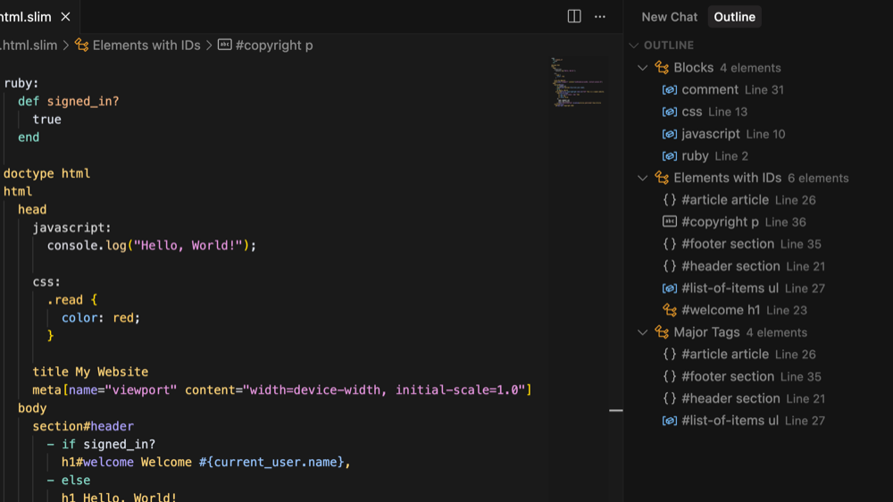

# Slim/Trim Language Support for VS Code

A comprehensive VS Code extension that provides syntax highlighting, formatting and code folding for Slim and Trim templates.

## Features

### Syntax Highlighting
- **HTML Elements**: Proper highlighting for all HTML tags
- **Attributes**: Support for ID (#) and class (.) selectors
- **Ruby Code**: Embedded Ruby code with proper syntax highlighting
- **Comments**: Support for both single line and block comments
- **Text Content**: Proper highlighting for text content with pipe (|) syntax
- **Doctype**: Special highlighting for doctype declarations

### Formatting
- **Auto-indentation**: Automatic indentation based on Slim structure
- **Configurable indentation**: Support for both spaces and tabs
- **Format on Save**: Option to automatically format files when saving
- **Range Formatting**: Format specific sections of code
- **On-type Formatting**: Auto-indent when pressing Enter

### Code Folding
- **Intelligent Folding**: Automatic folding ranges based on content structure
- **Block-based Folding**: Folds blocks with more than 5 lines by default
- **Configurable Threshold**: Adjustable minimum line count for folding via settings
- **Nested Folding**: Supports nested folding ranges for complex templates
- **Visual Indicators**: Clear fold markers for easy navigation

### Document Outline
- **Elements with IDs**: quickly jump to any element with an ID from an alphabetical list
- **Blocks**: jump to declarations of non-Slim blocks (CSS, Javascript, etc.)

## Installation

### From Source
1. Clone this repository
2. Run `npm install` to install dependencies
3. Run `npm run compile` to build the extension
4. Press `F5` in VS Code to launch the extension in a new window

### From VSIX
1. Build the extension: `npm run compile`
2. Package the extension: `vsce package`
3. Install the generated `.vsix` file in VS Code

## Configuration

The extension has multiple settings that can be changed:

## Usage

### Syntax Highlighting

### Formatting

- `Format Document` (Shift+Alt+F): Format the entire document
- `Format Selection` (Ctrl+K Ctrl+F): Format selected text
- Auto-format on save (if enabled)

### Outline

### Code folding

**Folding Behavior:**
- Adjust the threshold via `slim.codeFoldingDepth` setting

## Supported File Types
- `.slim` files
- `.trim` files

## Requirements
- VS Code 1.60.0 or higher

## Contributing

1. Fork the repository
2. Create a feature branch
3. Make your changes
4. Add tests if applicable
5. Submit a pull request

## License

(c) David Kelly 2025

MIT License - see LICENSE file for details.
